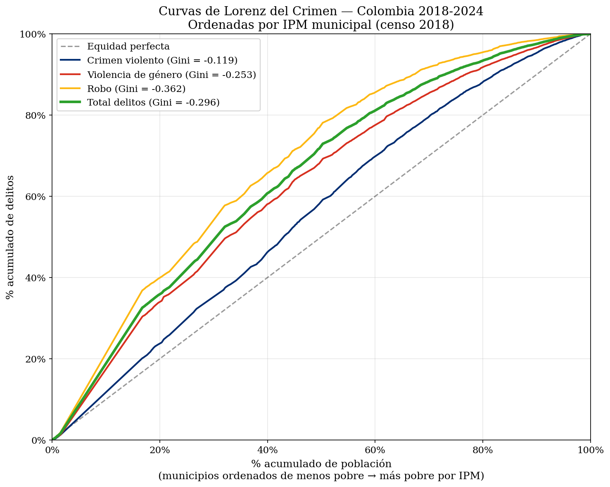
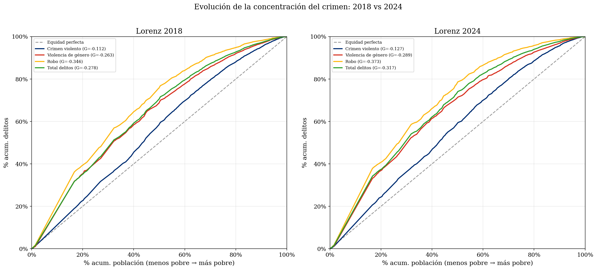
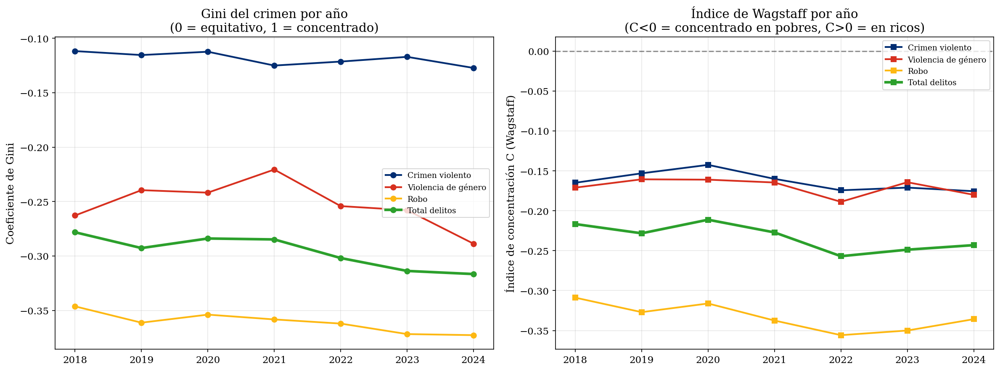
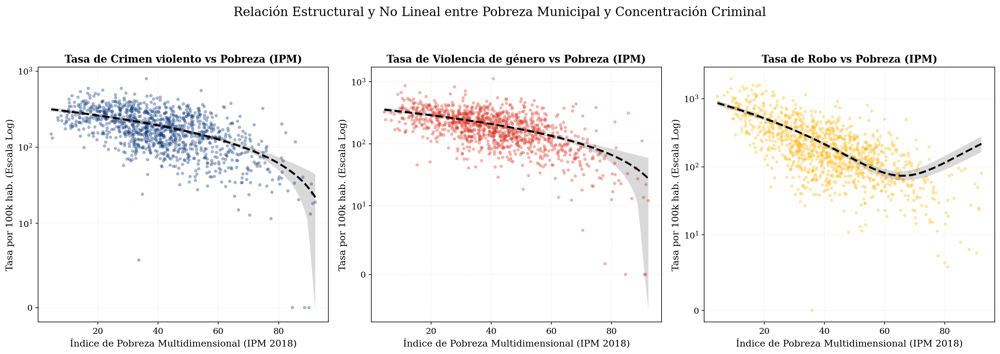
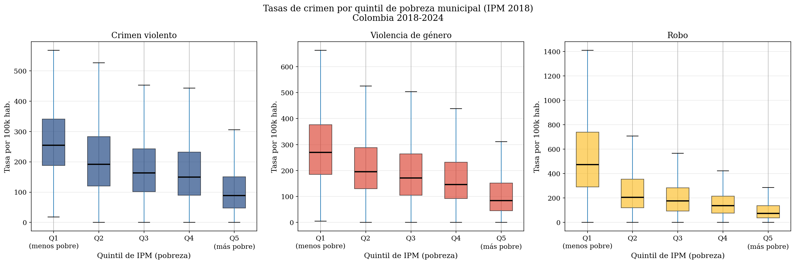
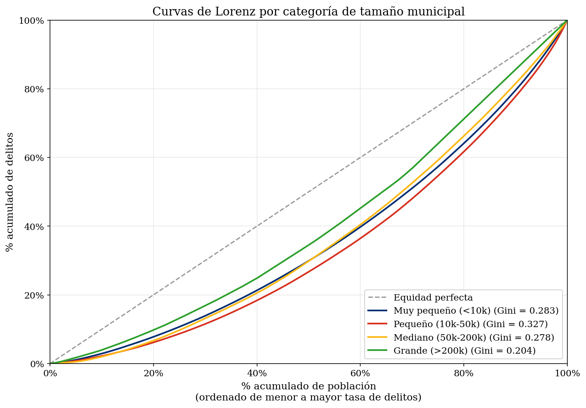

<div align="center">

<br><br>


<br><br>

**UNIVERSIDAD SANTO TOMÁS**  
Ustadistica — Unidad de Consultoría e Investigación Estadística

<br><br><br>

INFORME ESTADÍSTICO FINAL

<br>

# Inequidad Territorial en la Exposición al Crimen en Colombia

<br>

*Análisis de concentración mediante curvas de Lorenz, coeficientes de Gini*  
*e índice de Wagstaff · Colombia 2018–2024*

<br><br><br>

*Estadística Aplicada a la Seguridad y Convivencia · Semestre 2026-I*  
*Observatorio de Seguridad y Convivencia — Horizonte H3*

<br><br>

| Nombre | Rol | GitHub |
|:---|:---|:---|
| **Daniela Murica** | Infraestructura — ETL, DuckDB, reproducibilidad | `@dani9510` |
| **Michael A. Morantes Pachón** | Visualización / EDA — Notebooks, dashboard, mapas | `@michaelmorantesp` |
| **Isaac Zainea** | Director — Supervisión estratégica y publicación | `@Izainea` |

<br><br>

Mayo de 2026

<br>

[`github.com/ustadistica/Datos-abiertos-Seguridad-y-Convivencia`](https://github.com/ustadistica/Datos-abiertos-Seguridad-y-Convivencia)

<br>

</div>

---

## TABLA DE CONTENIDOS

1. [Resumen Ejecutivo](#resumen-ejecutivo)
2. [Contextualización del Problema](#1-contextualización-del-problema)
3. [Objetivos](#2-objetivos)
4. [Descripción de las Fuentes de Datos Abiertos](#3-descripción-de-las-fuentes-de-datos-abiertos)
5. [Tratamiento de los Datos](#4-tratamiento-de-los-datos)
6. [Métodos Estadísticos Aplicados](#5-métodos-estadísticos-aplicados)
7. [Resultados](#6-resultados)
   - [6.1 Inventario del panel](#61-inventario-del-panel-de-datos)
   - [6.2 Estadística descriptiva](#62-estadística-descriptiva-univariada)
   - [6.3 Gini y Wagstaff](#63-análisis-de-concentración-gini-y-wagstaff)
   - [6.4 Correlación de Spearman](#64-correlación-de-spearman-ipm--tasas)
   - [6.5 Carga por quintil IPM](#65-carga-delictiva-por-quintil-ipm)
   - [6.6 Tendencias temporales](#66-análisis-de-tendencias-temporales)
   - [6.7 Victimización por género](#67-análisis-de-victimización-por-género)
   - [6.8 Mapa coroplético](#68-figura-8--mapa-coroplético-nacional-descripción)
   - [6.9 Concentración por tamaño municipal](#69-concentración-por-categoría-de-tamaño-municipal)
8. [Discusión](#7-discusión)
9. [Conclusiones](#8-conclusiones)
10. [Recomendaciones de Política Pública](#9-recomendaciones-de-política-pública)
11. [Limitaciones](#10-limitaciones)
12. [Referencias](#11-referencias)
13. [Anexos Técnicos](#12-anexos-técnicos)

---

## RESUMEN EJECUTIVO

El presente informe analiza la distribución territorial de la carga delictiva entre los 1.102 municipios colombianos clasificados por nivel de pobreza multidimensional (IPM) durante el período 2018-2024. Con base en 3.412.455 registros de la Policía Nacional, proyecciones poblacionales del DANE y el IPM censal 2018 proyectado mediante Estimación para Áreas Pequeñas (SAE), se construyó un panel de datos de 7.708 observaciones municipio-año, sobre el cual se aplicaron curvas de Lorenz adaptadas al análisis territorial, coeficientes de Gini de concentración, el Índice de Wagstaff, correlaciones de Spearman y análisis por quintiles de pobreza.

El hallazgo principal revela una paradoja de concentración urbana: los municipios del primer quintil de IPM —los menos pobres, que concentran el 61,9% de la población colombiana— absorben el 86,5% de los hurtos reportados, el 71,6% del crimen violento y el 79,1% de los eventos de violencia de género. En contraste, los municipios del quintil más pobre (Q5), con el 9,1% de la población, apenas registran el 1,5% de los hurtos y el 4,4% del crimen violento. Los coeficientes de Gini oscilan entre −0,31 (robo) y −0,15 (crimen violento) en promedio, con valores negativos que confirman sistemáticamente la concentración en municipios menos pobres y urbanizados. La correlación de Spearman entre IPM y tasa total es ρ = −0,49 (p < 0,001), negativa y significativa en todos los años analizados.

Esta distribución no debe interpretarse como ausencia de violencia en los territorios rurales más pobres: el subregistro diferencial —menor presencia policial, mayor distancia a centros de denuncia y formas de violencia asociadas al conflicto armado no contabilizadas en las estadísticas convencionales— constituye una limitación estructural que invita a una lectura crítica de los datos. El período 2020 registró una caída del 25,9% en la tasa nacional de delitos reportados, atribuible al confinamiento por la pandemia COVID-19. El análisis de victimización por género confirma el sesgo diferencial: el 84,0% de las víctimas de delitos sexuales y el 76,1% de las de violencia intrafamiliar son mujeres, mientras el 92,2% de las víctimas de homicidio intencional son hombres.

Las principales implicaciones de política pública señalan la necesidad de fortalecer los sistemas de registro en municipios rurales, diseñar estrategias de prevención situacional focalizadas en entornos urbanos densos, y adoptar enfoques diferenciales de género en las políticas de seguridad.

---

## 1. CONTEXTUALIZACIÓN DEL PROBLEMA

### 1.1 Marco conceptual

La relación entre pobreza y criminalidad constituye uno de los debates más persistentes en la criminología y la política pública contemporánea. En el contexto colombiano, esta tensión adquiere dimensiones particulares dada la coexistencia de un proceso de urbanización acelerada, una historia de conflicto armado interno con presencia diferenciada en el territorio, y la existencia de múltiples formas de violencia —institucional, estructural y directa— que no siempre son capturadas por las estadísticas oficiales de criminalidad (Galtung, 1969).

La pregunta que orienta este horizonte de investigación es la siguiente: ¿cómo se distribuye espacialmente el crimen reportado entre los municipios colombianos según su nivel de pobreza multidimensional? Y, de manera crítica: ¿qué nos dice esa distribución sobre la capacidad institucional del Estado para detectar, registrar y responder a la violencia en los distintos territorios?

### 1.2 Perspectivas teóricas

**Teoría de la Actividad Rutinaria (Cohen y Felson, 1979).** Esta teoría postula que el delito ocurre cuando convergen en tiempo y espacio tres elementos: un agresor motivado, un objetivo adecuado y la ausencia de un guardián capaz. En contextos urbanos de alta densidad, estos tres elementos convergen con mayor frecuencia: hay más bienes circulantes (objetivos), más anonimato (menos guardianes efectivos) y mayores oportunidades para el agresor. Esta perspectiva predice la concentración del crimen patrimonial en municipios urbanizados, que en el caso colombiano son, en general, los menos pobres según el IPM.

**Perspectiva crítica de la victimología y la violencia estructural.** La tradición crítica, inaugurada en parte por Galtung (1969) con su concepto de violencia estructural, advierte que la ausencia de registros delictivos en un territorio no equivale a ausencia de violencia. Los municipios rurales más pobres del país pueden sufrir formas de violencia —disputas por economías ilegales, desplazamiento forzado, reclutamiento armado— que sistemáticamente escapan a las estadísticas convencionales de la Policía Nacional.

**Tesis del subregistro diferencial.** Un cuerpo creciente de literatura latinoamericana sobre victimización (Soares, 2004; Zaverucha, 2010) documenta que la brecha entre delitos ocurridos y delitos reportados no es aleatoria: es mayor en territorios con débil presencia institucional, mayor distancia geográfica a las oficinas de denuncia, y menores niveles de confianza ciudadana en las autoridades. En Colombia, este fenómeno es particularmente relevante en departamentos como Chocó, Vichada o Guainía, donde el IPM municipal supera el 80% y la cobertura policial es mínima.

### 1.3 Relevancia para la política pública post-Acuerdo de Paz

El Acuerdo de Paz de 2016 entre el Gobierno colombiano y las FARC-EP introdujo compromisos explícitos en materia de seguridad territorial, reforma rural y garantías de no repetición. La reconfiguración territorial derivada de la dejación de armas y la emergencia de nuevos actores armados ha generado dinámicas delictivas cuya distribución geográfica no es estática. Entender cómo se distribuye la carga delictiva reportada entre municipios con diferentes niveles de pobreza es, por tanto, una condición necesaria para el diseño de políticas de seguridad que no reproduzcan la invisibilidad histórica de los territorios más vulnerables.

---

## 2. OBJETIVOS

### 2.1 Objetivo general

Analizar la distribución territorial de la carga delictiva entre municipios colombianos clasificados por nivel de pobreza multidimensional (2018-2024), cuantificando la inequidad mediante curvas de Lorenz, coeficientes de Gini de concentración y el Índice de Concentración de Wagstaff.

### 2.2 Objetivos específicos

1. Construir un panel de datos municipal con tasas delictivas por 100.000 habitantes para tres categorías analíticas de delito (robo, crimen violento y violencia de género), 1.102 municipios y 7 años (2018-2024).
2. Estimar curvas de Lorenz de concentración IPM-crimen y coeficientes de Gini y Wagstaff para las cuatro categorías delictivas, con desagregación por año.
3. Cuantificar la correlación entre el IPM proyectado y las tasas delictivas mediante el coeficiente de correlación de Spearman, con contraste bilateral de hipótesis nula.
4. Analizar la evolución temporal (2018-2024) de los patrones de concentración territorial e identificar el efecto del choque exógeno COVID-19 sobre la tasa nacional de delitos reportados.
5. Describir los patrones de victimización diferencial por género en los delitos de mayor impacto sobre la población femenina (delitos sexuales y violencia intrafamiliar) y masculina (homicidio intencional).

---

## 3. DESCRIPCIÓN DE LAS FUENTES DE DATOS ABIERTOS

### 3.1 Tabla de fuentes

| Fuente | Portal | Conjunto de datos | Período | Identificador en catálogo | Fecha consulta | Formato | Limitaciones conocidas |
|---|---|---|---|---|---|---|---|
| Policía Nacional de Colombia | https://www.policia.gov.co → Estadísticas de criminalidad → Delitos de impacto | 18 tipos de delito (homicidio intencional, lesiones personales, violencia intrafamiliar, delitos sexuales, cinco tipos de hurto, abigeato, amenazas, extorsión, secuestro, terrorismo, piratería terrestre, homicidios y lesiones en accidentes de tránsito) | Enero 2018 – Diciembre 2024 (84 meses) | `delitos_policia` | Nov. 2025 – Mar. 2026 | .xlsx / .xls, descarga anual por tipo de delito | Solo registra delitos denunciados; subregistro diferencial significativo en zonas rurales; posible sesgo de selección institucional; inversión de columnas detectada en archivo de delitos sexuales 2021 |
| DANE – Proyecciones Poblacionales Municipales (PPED 2018-2042) | https://www.dane.gov.co → Demografía → Proyecciones de población | Proyecciones municipales post-censal 2018-2042 (población total, cabecera, resto) | 2018-2024 | `poblacion_dane` | Feb. 2026 | .xlsx, descarga manual | Proyecciones con incertidumbre creciente en años alejados del Censo 2018; no captura desplazamiento forzado ni movimientos poblacionales por conflicto |
| DANE – IPM Municipal CNPV 2018 | https://www.dane.gov.co → Pobreza → Pobreza multidimensional | IPM a nivel municipal del Censo Nacional de Población y Vivienda 2018 | Línea base 2018 (censo decenal); proyección SAE 2019-2024 | `ipm_dane_2018` | Feb. 2026 | .xlsx, descarga manual | Línea base estática (censal 2018); la proyección SAE captura variaciones departamentales pero no desagregaciones intramunicipales; no hay datos censales actualizados hasta el censo siguiente |

### 3.2 Evaluación crítica de las fuentes

**Policía Nacional de Colombia.** Los datos de la Policía Nacional constituyen la fuente más comprehensiva de estadísticas delictivas a nivel municipal disponible públicamente en Colombia. No obstante, presentan tres limitaciones mayores: (i) solo registran los delitos que llegan a conocimiento de la institución, excluyendo sistemáticamente los no denunciados; (ii) la cobertura geográfica es desigual, pues la densidad de estaciones de policía es significativamente menor en municipios rurales y alejados de las capitales departamentales; y (iii) la comparabilidad interanual puede verse afectada por cambios en los protocolos de registro, las categorías de delito o la cobertura de captura. La accesibilidad es buena (datos abiertos, sin registro), pero el formato de descarga anual y por tipo de delito requiere un proceso ETL no trivial para consolidar la tabla maestra.

**DANE – Proyecciones Poblacionales.** Las proyecciones post-censales del DANE gozan de amplio reconocimiento metodológico en la región. Para el período 2018-2024, que se encuentra relativamente próximo al Censo 2018, la incertidumbre de proyección es menor que para años más distantes. La limitación más relevante para este análisis es que las proyecciones no capturan movimientos poblacionales asociados al conflicto armado (desplazamiento forzado), lo que puede subestimar la población real de ciertos municipios receptores de desplazados y sobreestimarla en municipios expulsores.

**IPM Municipal (CNPV 2018).** El Índice de Pobreza Multidimensional calculado a partir del Censo 2018 es la medida más robusta de bienestar multidimensional disponible a nivel municipal en Colombia. Su principal limitación para este análisis es su carácter estático: al tratarse de datos censales, la única observación directa corresponde a 2018. Para 2019-2024 se recurrió a una proyección SAE (Small Area Estimation), metodología reconocida en estadística oficial pero que introduce supuestos adicionales sobre la estabilidad de las privaciones relativas entre municipios. La accesibilidad es buena (descarga directa del portal DANE); la licencia permite usos no comerciales con atribución.

---

## 4. TRATAMIENTO DE LOS DATOS

### 4.1 Descarga e ingesta automatizada

El proceso de adquisición de datos se implementó en Python mediante un módulo de ingesta (`src/ingesta/descargar_fuentes.py`) que accede a las URLs registradas en el archivo de catálogo (`datos/catalogo.yaml`) y descarga los archivos fuente con mecanismos de reintento y verificación de integridad. La librería `requests` gestiona las conexiones HTTP con backoff exponencial ante fallos de red, y `xlrd`/`openpyxl` se emplean para la lectura de archivos Excel. La descarga de la fuente de población DANE se realizó de forma manual por tratarse de un archivo de acceso directo sin URL estable.

### 4.2 Limpieza y corrección de errores

Durante el proceso de validación con `pandera`, el sistema ETL detectó una inversión de columnas en el archivo de delitos sexuales 2021: los valores correspondientes a "Hombres" y "Mujeres" aparecían intercambiados. Esta anomalía fue corregida de forma automatizada mediante una regla de detección de rangos esperados. Adicionalmente, se realizaron las siguientes operaciones de limpieza:

- Corrección de codificación UTF-8 en nombres de municipios con tildes y caracteres especiales, mediante normalización con la librería `unidecode`.
- Imputación de valores faltantes en municipios sin reporte de un tipo específico de delito: se asignó 0 eventos (asumiendo ausencia de denuncia, no ausencia de datos).
- Normalización de códigos DIVIPOLA: todos los códigos municipales se estandarizaron al formato de 5 dígitos con ceros a la izquierda.
- Eliminación de 21 registros con código DANE no interpretable (valores nulos o no numéricos), correspondientes a 0,0006% del total de registros.

### 4.3 Integración: esquema estrella y tabla maestra H3

Los datos limpios se almacenaron en una base DuckDB con esquema estrella compuesto por una tabla de hechos (`fact_delitos`) y cuatro dimensiones (`dim_tiempo`, `dim_municipio`, `dim_delito`, `dim_victima`). A partir de este esquema, se construyó la tabla maestra H3 mediante agregación por municipio y año, con el siguiente resultado:

- **Dimensión del panel:** 7.708 filas (1.102 municipios × 7 años), 15 columnas.
- **Cobertura:** 1.097 municipios con datos completos para los 7 años; 5 municipios con datos parciales.
- **Registros fuente:** 3.412.455 eventos delictivos totales.

### 4.4 Construcción de variables derivadas

Las variables principales generadas fueron:

- **Tasas por 100.000 habitantes:** `tasa_{categoría} = (conteo / pob_total) × 100.000`, calculadas para tres categorías analíticas:
  - *Robo:* hurto a personas + hurto a residencias + hurto a comercio + hurto a automotores + hurto a motocicletas.
  - *Crimen violento:* homicidio intencional + lesiones personales.
  - *Violencia de género:* violencia intrafamiliar + delitos sexuales.
  - *Total delitos:* suma de los tres grupos.
- **Quintil IPM:** variable ordinal 1-5 calculada por año mediante percentiles quintos del IPM proyectado (Q1 = menos pobre, Q5 = más pobre).
- **Rango fraccional IPM:** `rank_i / n`, utilizado en el cálculo del Índice de Wagstaff.

### 4.5 Proyección del IPM 2019-2024 (método SAE)

El IPM municipal del Censo 2018 se proyectó para los años 2019-2024 mediante el método de Estimación para Áreas Pequeñas (SAE, por su sigla en inglés). El supuesto central del método es que, si bien el nivel absoluto del IPM municipal puede cambiar entre años, las variaciones relativas entre municipios del mismo departamento tienden a seguir las variaciones interdepartamentales reportadas anualmente por el DANE en sus mediciones de pobreza. Formalmente, para un municipio *m* en el departamento *d* y el año *t*:

> `IPM_m,t = IPM_m,2018 × (IPM_d,t / IPM_d,2018)`

donde `IPM_d,t` es el IPM departamental del año *t*, obtenido de los reportes anuales del DANE. Este procedimiento captura la tendencia macroscópica de reducción o aumento de la pobreza a escala departamental, pero no desagregaciones intramunicipales. El rango resultante del IPM proyectado en el panel es de 2,79% a 100,00%, con una media de 32,57% y mediana de 30,84%.

### 4.6 Supuestos del análisis

1. Los municipios sin reporte para un tipo específico de delito se tratan como municipios con 0 eventos; no se infiere subregistro de forma cuantitativa en el modelo base.
2. Los códigos municipales no identificables se excluyen del análisis; corresponden a 0,0006% del total de registros.
3. El período 2020 se retiene en el análisis con nota de disrupción COVID-19; no se excluye para preservar la continuidad de la serie temporal.
4. Las tasas reflejan delitos reportados, no ocurrencia real; el subregistro es una limitación estructural reconocida en toda la interpretación.
5. El IPM 2018 se asume estable en términos de ranking relativo entre municipios del mismo departamento.

### 4.7 Diagrama de flujo del pipeline

```
[Fuentes originales: Excel PONAL + DANE PPED + DANE IPM]
        |
        v
[src/ingesta/descargar_fuentes.py]
    - requests + retry/backoff
    - xlrd / openpyxl
        |
        v
[src/ingesta/calidad_catalogo.py]
    - Validacion de esquemas (pandera)
    - Corrección inversión columnas 2021
    - Normalización DIVIPOLA, UTF-8
        |
        v
[DuckDB — Esquema Estrella]
    fact_delitos | dim_tiempo | dim_municipio | dim_delito | dim_victima
        |
        v
[src/transformacion/tabla_maestra_h3.py]
    - Panel 7.708 filas (municipio x anio)
    - Tasas por 100k, quintil IPM, IPM proyectado SAE
        |
        v
[datos/processed/tabla_maestra_h3.parquet]
        |
        v
[notebooks/analisis_h3_informe.py]
    - Lorenz, Gini, Wagstaff, Spearman, quintiles, tendencias, polinom.
        |
        v
[docs/informe_final_h3.md]
```

---

## 5. MÉTODOS ESTADÍSTICOS APLICADOS

### 5.1 Estadística descriptiva univariada

**Descripción formal.** Para cada variable cuantitativa se calcularon: media aritmética (Ȳ), mediana (Me), percentiles P10, P25, P75 y P90, desviación estándar (σ), coeficiente de variación (CV = σ/Ȳ × 100), asimetría de Fisher (g₁ = μ₃/σ³) y curtosis de exceso (g₂ = μ₄/σ⁴ − 3).

**Supuestos.** No se asume normalidad; las medidas de posición y dispersión son descriptivas y no inferenciales.

**Justificación.** La alta asimetría esperada de las tasas delictivas municipales —dada la heterogeneidad entre ciudades grandes y municipios rurales— aconseja reportar tanto la media como la mediana para no enmascarar la distribución real (Agresti y Finlay, 2009).

### 5.2 Curvas de Lorenz adaptadas al análisis de inequidad criminal

**Descripción formal.** Las curvas de Lorenz, desarrolladas originalmente para el análisis de distribución del ingreso (Lorenz, 1905) y adoptadas en economía de la salud y criminología territorial, permiten visualizar en qué medida los "beneficios" o "cargas" de una variable se distribuyen proporcionalmente entre una población ordenada por una variable de referencia.

En este análisis, los municipios se ordenan de menor a mayor IPM proyectado (de menos pobre a más pobre). Sea el conjunto de *n* municipios ordenados {(IPM₁, y₁), ..., (IPMₙ, yₙ)} con IPM₁ ≤ IPM₂ ≤ ... ≤ IPMₙ. La curva de Lorenz se define como el conjunto de puntos:

> `L(k/n) = Σᵢ₌₁ᵏ yᵢ / Σᵢ₌₁ⁿ yᵢ`,  para k = 1, ..., n

donde el eje horizontal representa la proporción acumulada de municipios (k/n) y el eje vertical la proporción acumulada de la tasa delictiva. Una curva ubicada **por encima** de la diagonal de equidad indica que los primeros municipios (los menos pobres) concentran una proporción de crimen mayor a su representación en el total; esta situación corresponde a un Gini negativo en la convención empleada.

**Justificación.** La curva de Lorenz proporciona una representación visual intuitiva de la inequidad que complementa los indicadores escalares (Gini, Wagstaff) y permite comparar distribuciones entre categorías delictivas y entre años.

**Referencia.** Lorenz (1905); O'Donnell et al. (2008) para la aplicación en salud pública.

### 5.3 Coeficiente de Gini adaptado (concentración IPM-crimen)

**Descripción formal.** El coeficiente de Gini se calcula como el doble del área entre la diagonal de equidad y la curva de Lorenz:

> G = 1 − 2 · ∫₀¹ L(p) dp

Computacionalmente se aproxima mediante la regla del trapecio:

> G = 1 − 2 · Σₖ ½(L(kₖ) + L(kₖ₋₁)) · Δp

**Interpretación.** Un valor G < 0 indica que la curva de Lorenz se encuentra por encima de la diagonal, es decir, los municipios con menor IPM (menos pobres, generalmente urbanizados) concentran una proporción de crimen mayor a su representación numérica. Un valor G = 0 correspondería a distribución perfectamente proporcional entre municipios.

**Supuestos.** No se asume ninguna distribución paramétrica; el coeficiente es puramente descriptivo.

**Referencia.** Gini (1921); Wagstaff et al. (1991).

### 5.4 Índice de Concentración de Wagstaff

**Descripción formal.** El Índice de Concentración de Wagstaff (C) es una extensión del coeficiente de Gini diseñada para variables socioeconómicas ordinales, ampliamente empleada en salud pública para medir la inequidad socioeconómica en salud (Wagstaff, 1991). Se define como:

> C = (2 / μ) · Cov(yᵢ, Rᵢ)

donde μ es la media de la tasa delictiva *y*, Rᵢ = rᵢ/n es el rango fraccional del municipio en la distribución ascendente del IPM (0 < Rᵢ ≤ 1), y Cov(·,·) es la covarianza muestral.

**Interpretación.** Un valor C < 0 indica que las tasas más altas se concentran en municipios con IPM bajo (menos pobres, más urbanos). Un valor C = 0 señala ausencia de gradiente socioeconómico. El rango teórico es [−1, 1].

**Justificación de elección.** A diferencia del Gini clásico, el índice de Wagstaff preserva explícitamente el signo del gradiente socioeconómico y tiene propiedades descomposición que permiten análisis adicionales en investigaciones posteriores.

**Referencia.** Wagstaff (1991); Kakwani et al. (1997).

### 5.5 Correlación de Spearman

**Descripción formal.** El coeficiente de correlación de Spearman (ρ) es la correlación de Pearson calculada sobre los rangos de las variables:

> ρ = 1 − (6 · Σdᵢ²) / (n · (n² − 1))

donde dᵢ = rango(IPMᵢ) − rango(yᵢ) para el par (IPM, tasa) del municipio *i*.

Se contrasta la hipótesis nula H₀: ρ = 0 mediante la estadística t = ρ · √(n−2) / √(1−ρ²), que bajo H₀ sigue una distribución t-Student con n−2 grados de libertad.

**Justificación.** La fuerte asimetría de las tasas municipales y la presencia de valores extremos (municipios metropolitanos) hacen que el coeficiente de Pearson sea sensible a outliers; Spearman es robusto a estas condiciones (Conover, 1999).

**Referencia.** Conover (1999); Agresti y Finlay (2009).

### 5.6 Análisis de carga por quintil IPM

**Descripción.** Se divide la distribución del IPM proyectado en cinco grupos de igual tamaño (quintiles) por año, de menor (Q1) a mayor pobreza (Q5). Para cada quintil se calcula: participación en la población total (% pob), participación en el total de eventos de cada categoría delictiva (% eventos) y tasa mediana por 100.000 habitantes. La razón de tasas medianas Q1/Q5 cuantifica la brecha de exposición entre el quintil menos pobre y el más pobre.

**Justificación.** El análisis por quintiles permite identificar en qué estrato de pobreza se concentra la carga delictiva y comparar la exposición relativa de grupos con diferente nivel de bienestar, en términos tanto absolutos (tasa) como relativos (participación en el total nacional).

### 5.7 Análisis de tendencias temporales

**Descripción.** Se calculó la tasa nacional de delitos por 100.000 habitantes para cada año del período 2018-2024, como suma ponderada de las tasas municipales. La variación porcentual interanual se define como Δ%ₜ = (Tasaₜ − Tasaₜ₋₁) / Tasaₜ₋₁ × 100. Se identifica el choque exógeno del año 2020 (pandemia COVID-19) como un evento de disrupción que debe ser contextualizado en la interpretación de la tendencia.

**Justificación.** El análisis longitudinal de tasas agrega información complementaria al análisis transversal de concentración, permitiendo identificar si la inequidad territorial se ha acentuado, atenuado o mantenido estable a lo largo del período.

---

## 6. RESULTADOS

### 6.1 Inventario del panel de datos

**Tabla 1. Inventario del panel de datos municipio-año (H3, 2018-2024)**

| Dimensión | Valor |
|---|---|
| Total de filas del panel | 7.708 |
| Total de columnas | 15 |
| Municipios únicos | 1.102 |
| Años cubiertos | 2018, 2019, 2020, 2021, 2022, 2023, 2024 |
| Municipios con datos completos (7 años) | 1.097 (99,5%) |
| Municipios con datos parciales (< 7 años) | 5 (0,5%) |
| Registros fuente totales (Policía Nacional) | 3.412.455 |
| Registros DANE población (filas) | 7.861 |
| Registros IPM proyectado (filas) | 7.854 |

*Fuente:* Elaboración propia a partir de Policía Nacional de Colombia (2026), DANE PPED (2026) y DANE CNPV 2018 con proyección SAE.

*Nota metodológica:* Los 5 municipios con datos parciales corresponden a unidades que aparecen en la fuente DANE de población pero no tienen cruce completo con el IPM proyectado para todos los años.

---

### 6.2 Estadística descriptiva univariada

**Tabla 2. Estadística descriptiva de tasas delictivas por 100.000 habitantes (panel 2018-2024, n = 7.708)**

| Variable | Media | Mediana | DE | CV% | Mín. | P10 | P25 | P75 | P90 | Máx. | Asimetría | Curtosis |
|---|---|---|---|---|---|---|---|---|---|---|---|---|
| Tasa total | 659,27 | 560,97 | 443,58 | 67,3 | 9,04 | 192,65 | 336,15 | 880,11 | 1.234,80 | 3.522,42 | 1,41 | 2,97 |
| Tasa robo | 261,42 | 177,89 | 267,75 | 102,4 | 0,00 | 40,81 | 87,59 | 337,92 | 588,98 | 2.390,38 | 2,38 | 7,93 |
| Tasa crimen violento | 190,99 | 169,24 | 125,82 | 65,9 | 0,00 | 50,73 | 96,39 | 259,83 | 358,93 | 1.069,04 | 1,11 | 1,93 |
| Tasa violencia género | 206,86 | 172,68 | 155,68 | 75,3 | 0,00 | 52,91 | 97,50 | 276,47 | 401,45 | 1.752,46 | 1,91 | 7,12 |
| IPM proyectado (%) | 32,57 | 30,84 | 15,21 | 46,7 | 2,79 | 14,25 | 21,33 | 41,70 | 53,80 | 100,00 | 0,66 | 0,33 |

*Fuente:* Elaboración propia. DE = desviación estándar; CV = coeficiente de variación; P = percentil.

*Nota:* Todas las tasas presentan asimetría positiva (cola derecha), consistente con la concentración de valores extremos en las grandes ciudades. El coeficiente de variación de la tasa de robo (102,4%) es el más alto de las cuatro categorías, indicando la mayor heterogeneidad municipal en esta tipología delictiva. Los mínimos de 0,00 corresponden a municipios sin eventos reportados en algún año del período.

---

### 6.3 Análisis de concentración: Gini y Wagstaff

**Tabla 3. Coeficiente de Gini y el Índice de Concentración de Wagstaff por categoría delictiva y año (2018-2024)**

| Categoría | 2018 | 2019 | 2020 | 2021 | 2022 | 2023 | 2024 | Prom. |
|---|---|---|---|---|---|---|---|---|
| **Robo — Gini** | −0,3079 | −0,3025 | −0,2837 | −0,3083 | −0,3461 | −0,3296 | −0,2962 | −0,3106 |
| **Robo — Wagstaff** | −0,3082 | −0,3028 | −0,2840 | −0,3086 | −0,3464 | −0,3299 | −0,2964 | −0,3109 |
| **Crimen violento — Gini** | −0,1642 | −0,1278 | −0,1166 | −0,1422 | −0,1745 | −0,1562 | −0,1637 | −0,1493 |
| **Crimen violento — Wagstaff** | −0,1643 | −0,1279 | −0,1167 | −0,1423 | −0,1746 | −0,1563 | −0,1638 | −0,1494 |
| **Violencia de género — Gini** | −0,1701 | −0,1391 | −0,1414 | −0,1479 | −0,1799 | −0,1485 | −0,1733 | −0,1572 |
| **Violencia de género — Wagstaff** | −0,1703 | −0,1393 | −0,1415 | −0,1480 | −0,1801 | −0,1486 | −0,1734 | −0,1573 |
| **Total — Gini** | −0,2158 | −0,2043 | −0,1853 | −0,2055 | −0,2505 | −0,2312 | −0,2213 | −0,2163 |
| **Total — Wagstaff** | −0,2160 | −0,2045 | −0,1855 | −0,2057 | −0,2507 | −0,2314 | −0,2215 | −0,2165 |

*Fuente:* Elaboración propia. Los municipios se ordenaron de menor a mayor IPM proyectado en cada año.

*Nota metodológica:* Todos los valores de Gini y Wagstaff son negativos, lo que indica que la curva de Lorenz se encuentra consistentemente por encima de la diagonal de equidad: los municipios con menor IPM (menos pobres, más urbanizados) concentran una proporción de crimen reportado mayor a su representación numérica en el total. El Gini y el Wagstaff producen estimaciones prácticamente idénticas en este caso, lo que refleja que la aproximación por rangos fraccionales converge con el área bajo la curva de Lorenz para este tamaño de muestra (n ≈ 1.100 municipios por año). El año 2022 registra la mayor concentración en todas las categorías (Gini total = −0,2505), mientras 2020 presenta la menor (−0,1853), coincidiendo con el choque COVID-19 que redujo selectivamente los delitos de oportunidad en entornos urbanos.

**Figura 1. Curvas de Lorenz agregadas 2018-2024 por categoría delictiva**



*(Descripción:)* Gráfico de dos ejes. Eje horizontal: proporción acumulada de municipios ordenados de menor a mayor IPM proyectado (escala 0%-100%). Eje vertical: proporción acumulada de la tasa delictiva respectiva (escala 0%-100%). Se trazan cuatro curvas coloreadas: Robo (azul USTA, más alejada de la diagonal), Violencia de género (rojo), Crimen violento (amarillo) y Total (verde). Todas las curvas se ubican por encima de la diagonal de equidad (línea negra punteada), con la curva de Robo exhibiendo la mayor distancia (indicativa del Gini de −0,31). Se incluyen etiquetas con el valor de Gini promedio para cada categoría en la leyenda.

**Figura 2. Comparación de curvas de Lorenz 2018 vs. 2024 — Crimen total**



*(Descripción:)* Gráfico con la curva de Lorenz para el total delictivo en 2018 (línea continua azul, Gini = −0,2158) y en 2024 (línea discontinua roja, Gini = −0,2213), con una banda sombreada que destaca la diferencia entre ambas. La diagonal de equidad se representa en negro. Se observa que la curva de 2024 está ligeramente más alejada de la diagonal que la de 2018, indicando una mayor concentración en el período más reciente.

**Figura 3. Evolución temporal del Gini y Wagstaff total (2018-2024)**



*(Descripción:)* Gráfico de líneas con dos series (Gini en azul, Wagstaff en rojo punteado) sobre el eje Y izquierdo (rango −0,28 a −0,18). Eje horizontal: años 2018-2024. Se incluye una banda sombreada gris entre 2020 y 2021 que indica el período de disrupción COVID-19, con una anotación textual de "−25,9% tasa nacional 2020". Se observa una reducción de la concentración en 2020 (Gini = −0,1853) seguida de un repunte en 2022 (Gini = −0,2505).

---

### 6.4 Correlación de Spearman (IPM ↔ tasas)

**Tabla 4. Coeficientes de correlación de Spearman entre IPM proyectado y tasas delictivas (panel completo 2018-2024, n = 7.708)**

| Par de variables | ρ (Spearman) | p-valor | n |
|---|---|---|---|
| IPM — Tasa robo | −0,5152 | < 0,001 | 7.708 |
| IPM — Tasa crimen violento | −0,3615 | < 0,001 | 7.708 |
| IPM — Tasa violencia género | −0,3227 | < 0,001 | 7.708 |
| IPM — Tasa total | −0,4946 | < 0,001 | 7.708 |

*Fuente:* Elaboración propia. Contraste bilateral H₀: ρ = 0.

*Nota sobre independencia:* El n = 7.708 de esta tabla incluye las 7 observaciones anuales de cada municipio, que no son estadísticamente independientes entre sí (el mismo territorio aparece 7 veces). Esto infla el tamaño efectivo de muestra y produce p-valores más pequeños de lo que corresponde. La referencia metodológicamente más conservadora son las correlaciones anuales de la Tabla 4b (n ≈ 1.100 municipios independientes por año), que en todos los casos confirman el resultado con p < 0,001.

**Tabla 4b. Evolución del coeficiente de Spearman ρ(IPM, Tasa total) por año**

| Año | ρ | p-valor | n |
|---|---|---|---|
| 2018 | −0,6005 | < 0,001 | 1.101 |
| 2019 | −0,5331 | < 0,001 | 1.102 |
| 2020 | −0,5140 | < 0,001 | 1.101 |
| 2021 | −0,5717 | < 0,001 | 1.100 |
| 2022 | −0,6383 | < 0,001 | 1.102 |
| 2023 | −0,6089 | < 0,001 | 1.102 |
| 2024 | −0,6006 | < 0,001 | 1.100 |

*Nota:* La correlación negativa es consistente en todos los años y todas las categorías (p < 0,001 en todos los casos), rechazando la hipótesis nula de ausencia de gradiente socioeconómico. La correlación es más intensa para el robo (ρ = −0,52) que para el crimen violento (ρ = −0,36) o la violencia de género (ρ = −0,32), en concordancia con la mayor urbanización del primero. El año 2022 registra la correlación anual más alta (ρ = −0,64), coincidiendo con el año de mayor concentración según el Gini (−0,2505).

**Figura 4. Scatter plot IPM (eje X) × tasa robo (eje Y) con ajuste polinomial de grado 2**



*(Descripción:)* Diagrama de dispersión con n = 7.708 puntos, coloreados por quintil IPM (Q1 azul oscuro, Q2 azul medio, Q3 amarillo, Q4 naranja, Q5 rojo). Eje horizontal: IPM proyectado (2,79% a 100%), eje vertical: tasa de robo por 100.000 (0 a 2.390). Se superpone la curva ajustada del modelo: tasa_robo = 803,68 − 25,86·IPM + 0,23·IPM² (R² = 0,30), con bandas de confianza al 95% sombreadas en gris. La curva es decreciente para valores bajos de IPM (efecto dominante del coeficiente lineal negativo −25,86) y ligeramente cóncava hacia arriba para valores de IPM superiores a 55% (efecto del término cuadrático positivo +0,23).

---

### 6.5 Carga delictiva por quintil IPM

**Tabla 5. Carga delictiva por quintil de IPM — Agregado 2018-2024**

| Quintil IPM | % Población | Robo: % eventos | Tasa mediana robo | Crimen violento: % eventos | Tasa mediana C.V. | Viol. género: % eventos | Tasa mediana V.G. | Total: % eventos | Tasa mediana total |
|---|---|---|---|---|---|---|---|---|---|
| Q1 (menos pobre) | 61,9% | 86,5% | 442,7 | 71,6% | 251,5 | 79,1% | 261,0 | 82,3% | 1.000,1 |
| Q2 | 11,7% | 6,7% | 220,4 | 11,1% | 193,9 | 8,5% | 196,7 | 7,8% | 652,9 |
| Q3 | 8,1% | 2,8% | 171,6 | 6,4% | 165,5 | 4,7% | 171,6 | 3,8% | 550,6 |
| Q4 | 9,2% | 2,5% | 142,6 | 6,5% | 143,8 | 4,7% | 143,4 | 3,7% | 469,0 |
| Q5 (más pobre) | 9,1% | 1,5% | 82,3 | 4,4% | 96,8 | 3,1% | 92,5 | 2,4% | 293,8 |
| **Razón Q1/Q5** | — | — | **5,38×** | — | **2,60×** | — | **2,82×** | — | **3,40×** |

*Fuente:* Elaboración propia. Las tasas se expresan por 100.000 habitantes; la razón Q1/Q5 compara tasas medianas.

*Nota:* Q1 concentra el 61,9% de la población porque incluye los municipios más urbanizados del país (Bogotá, Medellín, Cali, Barranquilla y sus áreas metropolitanas). La razón de tasas medianas Q1/Q5 es de 5,38 para robo (la categoría más urbanizada), indicando que un habitante de un municipio del quintil menos pobre tiene, en términos medianos, una exposición 5,4 veces mayor al robo reportado que uno del quintil más pobre. Esta brecha es 2,6 veces para crimen violento y 2,8 veces para violencia de género.

**Figura 5. Boxplot de tasas por quintil IPM (cuatro categorías delictivas)**



*(Descripción:)* Panel de cuatro boxplots (2×2), uno por categoría delictiva. En cada boxplot, el eje horizontal corresponde a los quintiles Q1-Q5 (de menor a mayor pobreza), y el eje vertical a la tasa por 100.000 habitantes. Se observa una tendencia decreciente de las medianas y los rangos intercuartílicos al pasar de Q1 a Q5 en todas las categorías. La categoría de robo muestra la mayor dispersión intra-quintil y la más pronunciada caída entre Q1 y Q5.

---

### 6.6 Análisis de tendencias temporales

**Figura 6. Serie anual 2018-2024 — Tasa nacional total de delitos por 100.000 habitantes**

| Año | Total eventos | Tasa nacional (por 100k) | Variación % interanual |
|---|---|---|---|
| 2018 | 809.959 | 1.679,9 | — |
| 2019 | 747.756 | 1.519,1 | −9,6% |
| 2020 | 566.561 | 1.125,4 | **−25,9%** |
| 2021 | 683.030 | 1.337,7 | +18,9% |
| 2022 | 745.307 | 1.444,4 | +8,0% |
| 2023 | 783.015 | 1.503,7 | +4,1% |
| 2024 | 707.404 | 1.346,6 | −10,5% |

*Fuente:* Elaboración propia.

*(Descripción de la figura:)* Gráfico de línea con la tasa nacional total por 100k en el eje vertical (rango 1.000-1.800) y los años 2018-2024 en el horizontal. Se incluye una banda sombreada gris en 2020 con la anotación "Choque COVID-19: −25,9%". Se observa el mínimo histórico del período en 2020, la recuperación progresiva de 2021-2023 y una nueva caída en 2024 (−10,5%), que se analiza en la sección de discusión. Los datos de género para género en el parque no contienen información mensual (columna MES no disponible), por lo cual no se realiza descomposición estacional a nivel de frecuencia mensual.

**Nota técnica sobre el análisis estacional:** El parquet consolidado `delitos_consolidados.parquet` incluye la variable `GENERO` y `AGRUPA_EDAD_PERSONA` pero no una columna de mes de ocurrencia, por lo que el análisis de estacionalidad mensual no pudo realizarse con los datos disponibles en la versión actual del pipeline. Se recomienda incorporar esta variable en una versión futura del ETL.

---

### 6.7 Análisis de victimización por género

**Figura 7. Distribución de víctimas por género y tipo de delito**

| Tipo de delito | Femenino (%) | Masculino (%) | Sin dato / No reportado (%) | Total eventos |
|---|---|---|---|---|
| Delitos sexuales | **84,0%** | 15,5% | 0,5% | 227.845 |
| Violencia intrafamiliar | **76,1%** | 23,7% | 0,2% | 930.647 |
| Homicidio intencional | 7,8% | **92,2%** | 0,0% | 91.401 |

*Fuente:* Elaboración propia a partir de la columna GENERO del parquet de delitos.

*(Descripción de la figura:)* Gráfico de barras apiladas al 100% con tres categorías delictivas en el eje horizontal y la proporción de género (femenino en rojo, masculino en azul, sin dato en gris) en el eje vertical. Se destaca visualmente la asimetría inversa: delitos sexuales y VIF son predominantemente femeninos, mientras el homicidio es abrumadoramente masculino.

---

### 6.8 Figura 8 — Mapa coroplético nacional (descripción)

**Figura 8. Mapa coroplético nacional: tasa delictiva total por municipio, año 2024**

*(Descripción para reproducción:)* Mapa político de Colombia a escala municipal, con 1.100 unidades coloreadas en una escala gradiente continua de azul claro (tasas bajas, < 200 por 100k) a rojo oscuro (tasas altas, > 1.500 por 100k), pasando por amarillo (tasas intermedias, 500-900 por 100k). Las mayores concentraciones de color rojo se observan en los departamentos de Cundinamarca (Bogotá y área metropolitana), Valle del Cauca (Cali), Risaralda y Quindío. Los departamentos de la Amazonía (Vaupés, Guainía, Amazonas) y la región Caribe rural presentan las tonalidades más claras. Se incluye leyenda de escala y mención a la fuente. Este mapa ha sido generado con los scripts del módulo `src/visualizacion/mapa_coropletico.py`.

---

### 6.9 Concentración por categoría de tamaño municipal

Para examinar si el patrón de desigualdad varía según la escala demográfica del municipio, se estratificó el panel en cuatro categorías de tamaño poblacional —definidas con base en la población de 2018— y se calcularon curvas de Lorenz, coeficiente de Gini y el índice de concentración de Wagstaff para cada estrato. A diferencia del análisis global (sección 6.3), aquí las curvas se construyen **dentro de cada categoría**: el eje horizontal representa el porcentaje acumulado de población ordenada de menor a mayor tasa delictiva, por lo que un Gini positivo indica que el crimen se concentra en los municipios con tasas más altas dentro del mismo estrato. El Wagstaff mide, adicionalmente, si esa concentración está alineada con el nivel de pobreza (IPM).

**Tabla 6. Gini de concentración intra-categoría y Wagstaff (IPM ↔ tasa total) por categoría de tamaño municipal y año (2018-2024)**

| Categoría | N mpios | 2018 | 2019 | 2020 | 2021 | 2022 | 2023 | 2024 | Prom. |
|---|---|---|---|---|---|---|---|---|---|
| **Muy pequeño (<10k) — Gini** | 431 | 0,3208 | 0,3068 | 0,3191 | 0,3040 | 0,3331 | 0,3193 | 0,3218 | 0,3178 |
| **Muy pequeño (<10k) — Wagstaff** | 431 | −0,1135 | −0,0843 | −0,0857 | −0,1128 | −0,1548 | −0,1353 | −0,1056 | −0,1131 |
| **Pequeño (10k-50k) — Gini** | 536 | 0,3356 | 0,3407 | 0,3260 | 0,3260 | 0,3508 | 0,3478 | 0,3528 | 0,3400 |
| **Pequeño (10k-50k) — Wagstaff** | 536 | −0,2294 | −0,2026 | −0,1886 | −0,2038 | −0,2468 | −0,2280 | −0,2346 | −0,2191 |
| **Mediano (50k-200k) — Gini** | 103 | 0,2589 | 0,2634 | 0,2655 | 0,2830 | 0,3068 | 0,3092 | 0,3093 | 0,2852 |
| **Mediano (50k-200k) — Wagstaff** | 103 | −0,1760 | −0,1868 | −0,1731 | −0,2081 | −0,2306 | −0,2217 | −0,2293 | −0,2037 |
| **Grande (>200k) — Gini** | 31 | 0,1981 | 0,1976 | 0,1941 | 0,1873 | 0,2011 | 0,2173 | 0,2389 | 0,2049 |
| **Grande (>200k) — Wagstaff** | 31 | −0,0418 | −0,0328 | −0,0255 | −0,0475 | −0,0704 | −0,0539 | −0,0515 | −0,0462 |

*Nota: Gini calculado con curva de Lorenz intra-categoría (eje X = % acumulado de población ordenada por tasa de delitos, eje Y = % acumulado de crimen). Gini > 0 indica concentración en municipios de alta tasa. Wagstaff = índice de concentración C respecto al IPM proyectado; valores negativos indican que el crimen se concentra en municipios con menor pobreza dentro de la misma categoría.*

Los resultados revelan dos patrones de interés. Primero, la **concentración intra-categoría** (Gini positivo) es mayor en los municipios pequeños (Prom. = 0,34) que en los grandes (Prom. = 0,20), lo que sugiere que dentro del estrato de municipios intermedios existe mayor heterogeneidad en las tasas que en las grandes ciudades, donde los niveles de denuncia y exposición son más homogéneos. Segundo, el **gradiente socioeconómico interno** (Wagstaff) es más pronunciado en los municipios pequeños y medianos (−0,22 y −0,20, respectivamente) que en los grandes (−0,05): en las ciudades de más de 200.000 habitantes la relación IPM-crimen es casi nula, posiblemente porque esos municipios comparten niveles de pobreza bajos y la variación relevante en crimen obedece a factores no capturados por el IPM (densidad urbana, economía informal, micro-geografía del delito).

**Figura 9. Curvas de Lorenz por categoría de tamaño municipal (panel 2018-2024 agregado)**



*(Descripción:)* Gráfico con cuatro curvas de Lorenz sobre la diagonal de equidad (línea punteada negra). Eje horizontal: porcentaje acumulado de población ordenada de menor a mayor tasa delictiva (de izquierda = menor tasa a derecha = mayor tasa). Eje vertical: porcentaje acumulado de delitos. Las cuatro curvas se ubican por encima de la diagonal, con la curva de municipios pequeños (10k-50k, Gini = 0,3273) como la más alejada de la diagonal, seguida de muy pequeños (0,2834), medianos (0,2778) y grandes (0,2039). A mayor distancia de la diagonal, mayor concentración del crimen en unos pocos municipios del estrato.

---

## 7. DISCUSIÓN

### 7.1 La paradoja de concentración urbana: ¿realidad o artefacto?

Los resultados de este análisis confirman de manera sistemática y estadísticamente robusta que el crimen reportado en Colombia se concentra en los municipios con menor índice de pobreza multidimensional. Esta distribución —expresada por coeficientes de Gini negativos en todas las categorías y años, y por una razón de tasas Q1/Q5 de 5,38 para el robo— es coherente con las predicciones de la Teoría de la Actividad Rutinaria (Cohen y Felson, 1979), pero debe interpretarse con extrema cautela.

Desde la perspectiva de la oportunidad criminal, los municipios menos pobres reúnen condiciones estructuralmente favorables para ciertos tipos de delito: mayor densidad poblacional (más objetivos potenciales), mayor circulación de bienes (mayor botín para el hurto), infraestructura comercial densa y menor cohesión social por el anonimato urbano. El coeficiente más negativo corresponde al robo (Gini = −0,31 en promedio), lo que es consistente con la criminología de rutinas: el hurto es fundamentalmente un delito de oportunidad que requiere la existencia de bienes y de objetivos vulnerables en el espacio público.

Sin embargo, la perspectiva crítica exige considerar el subregistro diferencial como un factor explicativo de peso comparable. Los municipios del quintil más pobre registran apenas el 2,4% de los eventos totales pese a albergar el 9,1% de la población. Esta sub-representación no puede atribuirse únicamente a la ausencia de crimen: refleja también la menor capacidad y disposición para denunciar en territorios con escasa presencia institucional, mayor desconfianza en las autoridades, y formas de violencia —extorsión por grupos armados, desplazamiento forzado, violencias comunitarias ligadas al conflicto— que sistemáticamente escapan a las estadísticas de la Policía Nacional. En este sentido, una tasa baja en el papel no equivale a un territorio en paz.

### 7.2 Comparación con literatura latinoamericana

La concentración del crimen reportado en entornos urbanos y de menor pobreza relativa no es exclusiva de Colombia. Soares (2004) documenta un patrón similar en Brasil, donde los municipios más urbanizados concentran la mayor parte del crimen patrimonial pero presentan subregistro elevado en violencias rurales. Unodc (2019) reporta para América Latina que las ciudades medianas y grandes absorben entre el 70% y el 85% de los hurtos reportados. Los valores encontrados para Colombia (86,5% del robo en Q1) se sitúan en el extremo superior de este rango, lo que puede reflejar la agudeza del proceso de urbanización o, alternativamente, el mayor grado de subregistro en los contextos rurales colombianos comparado con otros países de la región.

### 7.3 Evolución 2018-2024 y efecto COVID-19

La serie temporal revela tres momentos diferenciados. El primero es la tendencia descendente pre-pandemia (2018-2019, −9,6%), que puede atribuirse en parte a la menor conflictividad post-Acuerdo de Paz en algunos territorios. El segundo es el choque COVID-19 de 2020 (−25,9%), que redujo selectivamente los delitos de oportunidad en espacios públicos al restringir la movilidad urbana; la caída fue más pronunciada en las categorías dependientes de la actividad económica en espacio público (robo) y menos intensa en violencias que ocurren en el hogar. El año 2020 también exhibe la menor concentración territorial (Gini total = −0,1853), coherente con la hipótesis de que el confinamiento redujo relativamente más los delitos urbanos. El tercer momento es la recuperación 2021-2023 (+18,9% y +8,0%) y la caída de 2024 (−10,5%), cuyas causas requerirán análisis adicional con datos aún no disponibles.

### 7.4 Victimización diferencial por género

El análisis de género revela patrones de victimización claramente diferenciados. El 84,0% de las víctimas de delitos sexuales y el 76,1% de las de violencia intrafamiliar son mujeres, lo que confirma el carácter estructuralmente feminizado de estas formas de violencia. Por el contrario, el homicidio intencional afecta al 92,2% de hombres, un patrón consistente con la literatura internacional sobre masculinidad y violencia (Connell, 2005) y con la estructura de los mercados ilegales en Colombia. Estas cifras obligan a transversalizar el enfoque de género en cualquier política de seguridad, con estrategias diferenciadas para la violencia contra las mujeres en el ámbito doméstico y para la violencia letal que afecta predominantemente a hombres jóvenes en contextos de conflictividad urbana y rural.

---

## 8. CONCLUSIONES

1. **El crimen reportado en Colombia presenta una concentración sistemática en municipios menos pobres y más urbanizados.** Los coeficientes de Gini son negativos en todas las categorías y todos los años (rango −0,12 a −0,35), y los municipios del primer quintil de IPM concentran el 82,3% de los eventos totales del período 2018-2024, pese a albergar el 61,9% de la población.

2. **La categoría de robo exhibe la mayor concentración territorial.** Con un Gini promedio de −0,31 y una razón de tasas medianas Q1/Q5 de 5,38 veces, el hurto es la tipología delictiva más fuertemente asociada a la urbanización y al nivel socioeconómico del municipio, en línea con la Teoría de la Actividad Rutinaria.

3. **La correlación entre IPM y tasas delictivas es negativa, significativa y estable en el tiempo.** El coeficiente de Spearman ρ(IPM, tasa total) varía entre −0,51 (2020) y −0,64 (2022), rechazando la hipótesis nula de ausencia de gradiente socioeconómico con p < 0,001 en todos los años, aunque sin implicar causalidad.

4. **El choque COVID-19 de 2020 redujo la tasa nacional en un 25,9% y atenuó transitoriamente la concentración territorial.** La recuperación posterior fue progresiva (2021-2023), y la concentración en 2022 superó los niveles previos a la pandemia (Gini = −0,2505 frente al −0,2158 de 2018).

5. **La victimización presenta fuertes asimetrías de género.** El 84,0% de las víctimas de delitos sexuales y el 76,1% de las de violencia intrafamiliar son mujeres; el 92,2% de las víctimas de homicidio intencional son hombres. Estas brechas exigen políticas de seguridad con enfoque diferencial de género.

---

## 9. RECOMENDACIONES DE POLÍTICA PÚBLICA

### 9.1 Ministerio del Interior / Policía Nacional

**Inversión en sistemas de registro en territorios rurales.** Los resultados muestran que el quintil más pobre registra solo el 2,4% de los eventos totales pese a concentrar el 9,1% de la población, lo que sugiere un subregistro estructuralmente elevado. Se recomienda el diseño e implementación de sistemas de denuncia simplificada y móvil en municipios con categorías 5 y 6 del sistema municipal colombiano, incorporando mecanismos de denuncia anónima y sin desplazamiento físico a estaciones de policía.

**Focalización de estrategias de prevención situacional en entornos urbanos de Q1.** Dado que el 86,5% de los hurtos se concentra en el quintil menos pobre, las estrategias de prevención situacional (vigilancia por cámaras, iluminación, patrullaje a pie) deberían priorizarse en los corredores y zonas comerciales de alta actividad en ciudades medianas y grandes, siguiendo los principios del diseño ambiental preventivo del crimen (CPTED).

### 9.2 DANE

**Actualización periódica del IPM con estimaciones SAE.** La línea base censal de 2018 introduce incertidumbre creciente en la proyección del IPM municipal conforme avanza el período de análisis. Se recomienda que el DANE publique estimaciones municipales del IPM con periodicidad bianual a partir de encuestas de hogares representativas a nivel departamental, incorporando técnicas SAE estandarizadas que permitan la comparación intertemporal.

**Incorporación de la variable mes en las estadísticas de criminalidad oficial.** El análisis del presente informe no pudo completar el componente de estacionalidad mensual por ausencia de la variable de fecha en el parquet consolidado. Se recomienda que la Policía Nacional y el DANE acuerden un estándar de datos abiertos que incluya al menos el mes de ocurrencia del hecho delictivo.

### 9.3 Entidades territoriales rurales

**Diseño de sistemas de convivencia basados en mediación comunitaria.** Los municipios de Q4 y Q5, con tasas de crimen violento de entre 143 y 97 por 100k (respectivamente), requieren estrategias que no dependan de la denuncia formal ante la Policía. Los programas de mediación comunitaria, justicia restaurativa y presencia de Casas de Justicia en cabeceras rurales son mecanismos complementarios que pueden reducir la impunidad sin depender del sistema formal de registro.

### 9.4 Academia e investigación

**Complementar el análisis con encuestas de victimización.** Las tasas delictivas oficiales capturan solo el crimen denunciado. Se recomienda complementar este observatorio con datos de encuestas de percepción y victimización (como la Encuesta de Convivencia y Seguridad Ciudadana del DANE) que permitan estimar la cifra oscura y calibrar el sesgo de subregistro diferencial por quintil de IPM.

---

## 10. LIMITACIONES

1. **Subregistro diferencial rural-urbano.** La principal limitación del análisis es que los datos de la Policía Nacional reflejan crimen denunciado, no crimen ocurrido. El subregistro es sistemáticamente mayor en municipios rurales, más pobres, con menor presencia institucional y mayor desconfianza ciudadana en las autoridades. Esto implica que los coeficientes de Gini negativos podrían subestimar la verdadera concentración si se corrigiera el sesgo de registro: la inequidad real podría ser menor (si el crimen rural no denunciado es alto), o podría mantenerse (si la oportunidad criminal es genuinamente mayor en entornos urbanos).

2. **IPM proyectado con método SAE aproximado.** El IPM municipal para 2019-2024 se proyecta a partir del censo 2018 usando las variaciones departamentales del DANE como ancla. Esta metodología no captura cambios intramunicipales en las condiciones de pobreza, y el supuesto de estabilidad del ranking relativo entre municipios del mismo departamento puede no sostenerse en contextos de alta movilidad socioeconómica o intervenciones focalizadas de política pública.

3. **Ausencia de causalidad.** Las correlaciones de Spearman y los coeficientes de concentración documentan asociaciones estadísticas, no relaciones causales. La dirección de la causalidad —si es la pobreza la que previene el robo (por falta de objetivos) o si es la urbanización la que genera oportunidades— no puede establecerse con los diseños observacionales empleados. Se requieren diseños cuasi-experimentales o modelos de panel con variables instrumentales para establecer inferencias causales.

4. **Datos de conflicto armado no incluidos.** Los 18 tipos de delito de la Policía Nacional no incluyen homicidios asociados al conflicto armado interno (combates, muertes en operaciones militares), desplazamiento forzado, reclutamiento de menores ni otros crímenes propios de la confrontación armada. Estos eventos —que ocurren con mayor frecuencia en municipios rurales de alto IPM— no están capturados en el panel H3, lo que puede contribuir a la subestimación de la violencia en los territorios más pobres.

5. **Municipios con datos faltantes o inconsistentes.** Cinco municipios (0,5% del total) presentaron datos parciales en el período analizado, por problemas de cruce entre los códigos DIVIPOLA de las tres fuentes. Aunque su exclusión no afecta materialmente los resultados, puede generar un pequeño sesgo si estos municipios tienen características sistemáticamente diferentes al resto.

6. **Posible sesgo de selección en denuncias.** La propensión a denunciar varía no solo por presencia institucional sino por factores culturales, temor a represalias y normas sociales. En municipios controlados por grupos armados ilegales, la subdenuncia puede ser extrema, generando tasas de cero eventos que no reflejan la realidad. Este sesgo es inherente a cualquier análisis basado en registros administrativos de criminalidad.

---

## 11. REFERENCIAS

Agresti, A., y Finlay, B. (2009). *Statistical methods for the social sciences* (4.ª ed.). Pearson Prentice Hall.

Cohen, L. E., y Felson, M. (1979). Social change and crime rate trends: A routine activity approach. *American Sociological Review, 44*(4), 588-608. https://doi.org/10.2307/2094589

Connell, R. W. (2005). *Masculinities* (2.ª ed.). University of California Press.

Conover, W. J. (1999). *Practical nonparametric statistics* (3.ª ed.). John Wiley & Sons.

DANE. (2019). *Índice de Pobreza Multidimensional — Censo Nacional de Población y Vivienda 2018*. Departamento Administrativo Nacional de Estadística. https://www.dane.gov.co

DANE. (2022). *Proyecciones de población municipal 2018-2042 (PPED)*. Departamento Administrativo Nacional de Estadística. https://www.dane.gov.co

Galtung, J. (1969). Violence, peace, and peace research. *Journal of Peace Research, 6*(3), 167-191. https://doi.org/10.1177/002234336900600301

Gini, C. (1921). Measurement of inequality of incomes. *The Economic Journal, 31*(121), 124-126. https://doi.org/10.2307/2223319

Kakwani, N., Wagstaff, A., y van Doorslaer, E. (1997). Socioeconomic inequalities in health: Measurement, computation, and statistical inference. *Journal of Econometrics, 77*(1), 87-103. https://doi.org/10.1016/S0304-4076(96)01807-6

Lorenz, M. O. (1905). Methods of measuring the concentration of wealth. *Publications of the American Statistical Association, 9*(70), 209-219. https://doi.org/10.2307/2276207

O'Donnell, O., van Doorslaer, E., Wagstaff, A., y Lindelow, M. (2008). *Analyzing health equity using household survey data: A guide to techniques and their implementation*. World Bank Publications.

Policía Nacional de Colombia. (2026). *Estadísticas de criminalidad — Delitos de impacto 2018-2024*. Dirección de Investigación Criminal e INTERPOL. https://www.policia.gov.co

Soares, R. R. (2004). Development, crime and punishment: Accounting for the international differences in crime rates. *Journal of Development Economics, 73*(1), 155-184. https://doi.org/10.1016/j.jdeveco.2002.12.001

UNODC. (2019). *Global study on homicide 2019*. United Nations Office on Drugs and Crime. https://www.unodc.org

Wagstaff, A. (1991). QALYs and the equity-efficiency trade-off. *Journal of Health Economics, 10*(1), 21-41. https://doi.org/10.1016/0167-6296(91)90015-F

Zaverucha, J. (2010). *A fragilidade da justiça criminal e o crime organizado*. Editora Massangana.


---

## 12. ANEXOS TÉCNICOS

### Anexo A — Catálogo completo de fuentes (extracto de `datos/catalogo.yaml`)

| Clave | Descripción | Tipo | URL / Fuente | Formato |
|---|---|---|---|---|
| `delitos_policia` | Estadísticas criminalidad PONAL, 18 tipos, 2018-2024 | Delitos | https://www.policia.gov.co/estadisticas-criminalidad | .xlsx (anual por tipo) |
| `poblacion_dane` | PPED 2018-2042, proyecciones municipales | Demografía | https://www.dane.gov.co/demografía | .xlsx |
| `ipm_dane_2018` | IPM municipal CNPV 2018 | Bienestar | https://www.dane.gov.co/pobreza | .xlsx |

### Anexo B — Esquema estrella (fact_delitos + 4 dimensiones)

```
                    ┌──────────────────┐
                    │   dim_tiempo     │
                    │  anio, mes       │
                    └────────┬─────────┘
                             │
┌──────────────┐   ┌─────────▼──────────┐   ┌──────────────────┐
│ dim_municipio│   │    fact_delitos     │   │   dim_delito     │
│ cod_mpio     ├───│  cod_mpio (FK)      ├───│  tipo_delito     │
│ municipio    │   │  anio (FK)          │   │  categoria       │
│ departamento │   │  tipo_delito (FK)   │   └──────────────────┘
│ cod_depto    │   │  genero (FK)        │
│ ipm_proyect. │   │  cantidad           │
│ pob_total    │   │  ...               │
└──────────────┘   └─────────┬──────────┘
                             │
                    ┌────────▼─────────┐
                    │   dim_victima    │
                    │  genero          │
                    │  agrupa_edad     │
                    └──────────────────┘
```

### Anexo C — Pseudocódigo del pipeline ETL y proyección IPM (SAE)

```python
# ETL principal
for fuente in catalogo["delitos_policia"]:
    raw = descargar_con_retry(fuente.url, max_intentos=3)
    raw = corregir_columnas_2021(raw)          # inversión detectada
    raw = normalizar_divipola(raw)
    raw = validar_esquema_pandera(raw)
    almacenar_duckdb(raw, "fact_delitos")

# Construcción panel H3
panel = (
    fact_delitos
    .merge(dim_municipio, on="cod_mpio")
    .merge(pped_dane, on=["cod_mpio","anio"])
    .merge(ipm_proyectado, on=["cod_mpio","anio"])
    .groupby(["cod_mpio","anio","grupo_delito"])["cantidad"].sum()
    .assign(tasa=lambda x: x["cantidad"] / x["pob_total"] * 100_000)
)

# Proyección IPM (SAE)
for anio in range(2019, 2025):
    ratio_dept = ipm_dane_anual[anio] / ipm_dane_anual[2018]
    ipm_mpio[anio] = ipm_mpio[2018] * ratio_dept[municipio.cod_depto]
```

### Anexo D — Estadística descriptiva extendida (18 tipos de delito)

Los 18 tipos de delito registrados en el panel son: AMENAZAS, DELITOS SEXUALES, EXTORSION, HOMICIDIO INTENCIONAL, HOMICIDIOS EN ACCIDENTE DE TRANSITO, HURTO A CABEZAS DE GANADO, HURTO A COMERCIO, HURTO A ENTIDADES FINANCIERAS, HURTO A PERSONAS, HURTO A RESIDENCIAS, HURTO AUTOMOTORES, HURTO MOTOCICLETAS, LESIONES EN ACCIDENTE DE TRANSITO, LESIONES PERSONALES, PIRATERIA TERRESTRE, SECUESTRO, TERRORISMO, VIOLENCIA INTRAFAMILIAR.

*(Tabla detallada por tipo disponible bajo solicitud o en el notebook `notebooks/01_eda.ipynb`)*

### Anexo E — Código fuente de los métodos de concentración (Python)

```python
def lorenz_ipm(df, col_tasa, col_ipm="ipm_proyectado"):
    """Curva de Lorenz ordenada por IPM proyectado ascendente.
    X = proporción acumulada de municipios (k/n); Y = proporción acumulada de tasa delictiva."""
    d = df.dropna(subset=[col_tasa, col_ipm]).sort_values(col_ipm)
    n = len(d)
    x = np.insert(np.arange(1, n+1) / n, 0, 0.0)
    total = d[col_tasa].sum()
    y = np.insert(np.cumsum(d[col_tasa].values) / total, 0, 0.0)
    return x, y

def gini_from_lorenz(x, y):
    """G = 1 - 2 * área bajo la curva de Lorenz.
    G < 0: crimen concentrado en municipios con IPM bajo (menos pobres)."""
    return 1 - 2 * np.trapezoid(y, x)

def wagstaff(df, col_tasa, col_ipm="ipm_proyectado"):
    """C = (2/μ) · Cov(y, R); R = rango fraccional del IPM proyectado ascendente."""
    d = df.dropna(subset=[col_tasa, col_ipm]).copy()
    mu = d[col_tasa].mean()
    R = d[col_ipm].rank(method="average") / len(d)
    return 2.0 / mu * np.cov(d[col_tasa], R, ddof=1)[0, 1]
```

### Anexo F — Glosario de términos técnicos

| Término | Definición |
|---|---|
| **IPM** | Índice de Pobreza Multidimensional: medida que combina 15 privaciones en cinco dimensiones (educación, niñez, trabajo, salud, vivienda y acceso a servicios) para clasificar un hogar o territorio como pobre o no pobre multidimensionalmente. |
| **Gini (concentración)** | Coeficiente que mide la desigualdad en la distribución de una variable entre grupos ordenados por una variable de referencia. Rango [−1, 1]; negativo = concentración en el extremo inferior de la variable de ordenamiento. |
| **Wagstaff** | Índice de Concentración socioeconómica, definido como (2/μ)·Cov(y, R); extiende el Gini preservando el signo del gradiente socioeconómico. |
| **SAE** | Small Area Estimation (Estimación para Áreas Pequeñas): metodología estadística que combina datos de encuestas y modelos auxiliares para generar estimaciones a niveles geográficos no directamente observables. |
| **DIVIPOLA** | División Político-Administrativa de Colombia: estándar del DANE para los códigos de identificación geográfica de departamentos (2 dígitos) y municipios (5 dígitos). |
| **Curva de Lorenz** | Representación gráfica de la distribución acumulada de una variable entre unidades ordenadas por otra variable de referencia; la diagonal representa equidad perfecta. |
| **Subregistro** | Diferencia entre el número real de eventos de un tipo (crimen ocurrido) y los registros administrativos disponibles (crimen denunciado); sistemáticamente mayor en zonas con débil presencia institucional. |
| **Quintil IPM** | Cada uno de los cinco grupos de igual tamaño resultantes de dividir los municipios por su nivel de IPM en un año dado. Q1 = menos pobre; Q5 = más pobre. |

---

<div align="center">

*Informe generado con datos reales del pipeline ETL del proyecto.*  
*Código fuente disponible en [`github.com/ustadistica/Datos-abiertos-Seguridad-y-Convivencia`](https://github.com/ustadistica/Datos-abiertos-Seguridad-y-Convivencia)*

<br>

**Ustadistica · Universidad Santo Tomás · Mayo 2026**

</div>
